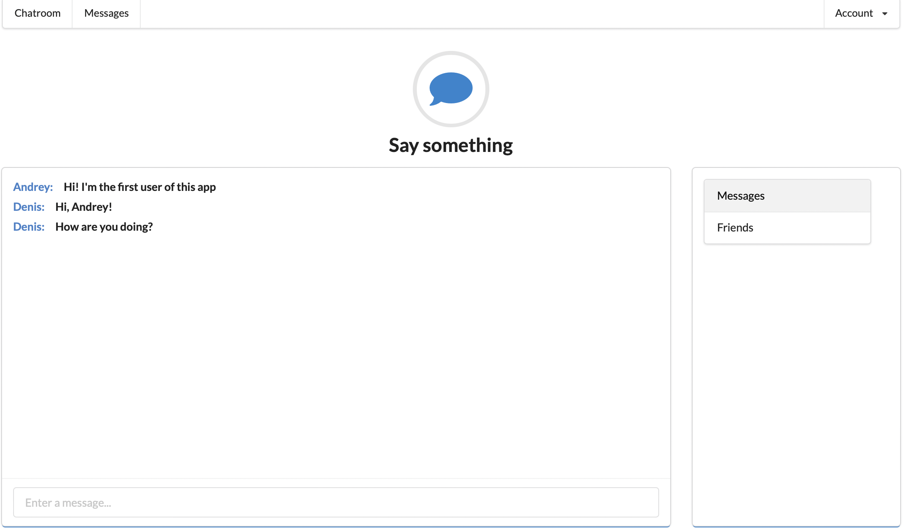

# Project Name
> MessageMe chat app using ActionCable and web sockets from [the Complete Ruby on Rails Developer course](https://www.udemy.com/course/the-complete-ruby-on-rails-developer-course/)
> Made with the Ruby on Rails 5 and SemanticUI frontend framework
> Live demo [_here_](https://message-me-61.herokuapp.com). <!-- If you have the project hosted somewhere, include the link here. -->

## Table of Contents
* [General Info](#general-information)
* [Technologies Used](#technologies-used)
* [Features](#features)
* [Screenshots](#screenshots)
* [Project Status](#project-status)
* [Room for Improvement](#room-for-improvement)
* [Acknowledgements](#acknowledgements)
* [Contact](#contact)
<!-- * [License](#license) -->

## General Information
- MessageMe is a template chat app with working main functionalities - users sign in/sign up forms and chatroom where users can send messages to the group chat

## Technologies Used
- Ruby on Rails - version 5.2.8
- SemanticUI - version 2.4.2
- PostgreSQL - version 14.4

## Features
List the ready features here:
- Users authenticate system with restrictions
- Real-time broadcasting messages using ActionCable

## Screenshots

## Project Status
Project is: _in progress_

## Room for Improvement
To do:
- Displaying online users
- Sending private messages feature

## Acknowledgements
his project was based on [Ruby on Rails course](https://www.udemy.com/course/the-complete-ruby-on-rails-developer-course/).

## Contact
Created by [@Andrey Timakhovich](https://www.linkedin.com/in/andrey-timakhovich-5a2429169/) - feel free to contact me!
